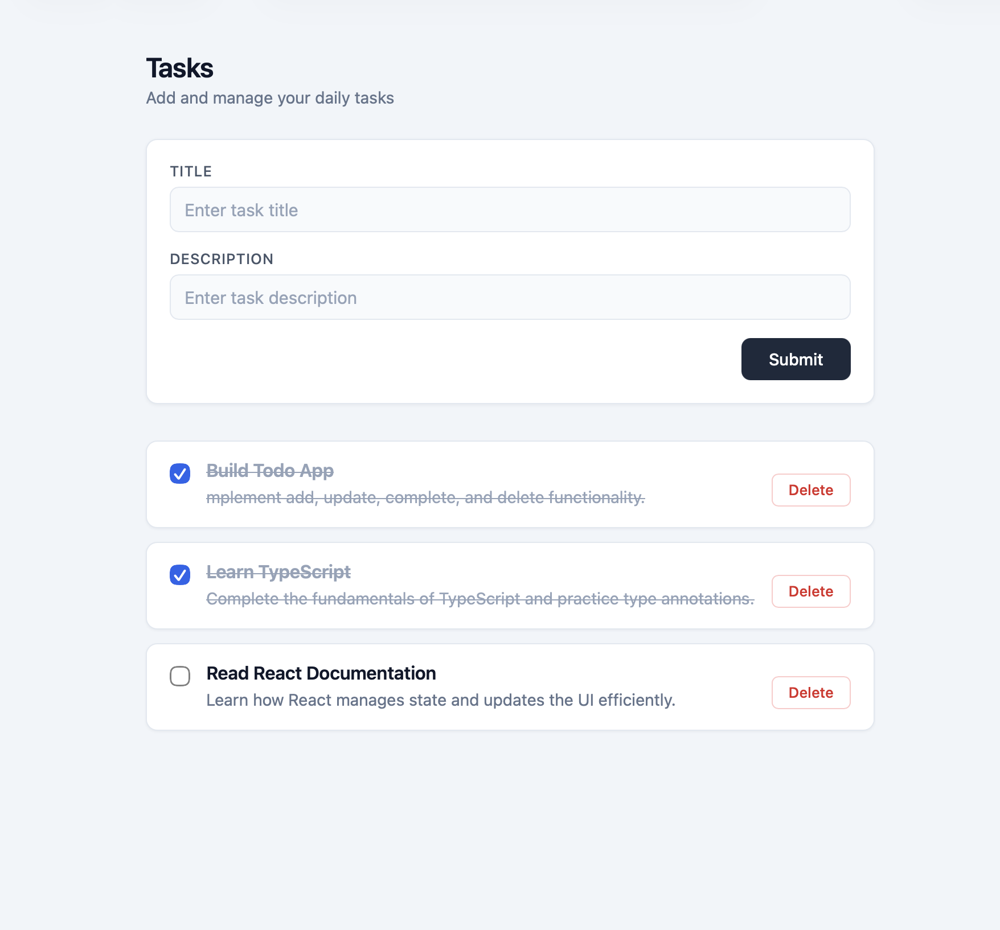

# TinyReconciler

A Todo application built with **TypeScript, Vite, and Bun** to explore how reactive UI updates can be implemented without React or another frontend framework.

The goal of this project is not simply to build a Todo list. It is to understand what happens underneath a reactive UI system: maintaining application state, detecting state changes, and updating only the affected parts of the DOM.



## Why I Built This

Modern frontend frameworks make UI state management feel simple:

```text
State changes
     ↓
UI updates
```

But I wanted to understand what happens between those two steps.

This project is an attempt to build that mechanism from scratch using the browser's native DOM APIs.

Instead of re-rendering the entire Todo list whenever the state changes, the application compares the previous state with the next state and applies only the necessary DOM changes.

That means the project explores concepts such as:

- State management
- Immutable state updates
- State reconciliation
- DOM diffing
- Targeted DOM updates
- Event-driven UI architecture
- Type-safe frontend development

## Core Idea

The application follows this flow:

```text
User Action
     ↓
Create New State
     ↓
Compare Old State ↔ New State
     ↓
Detect Changes
     ↓
ADD / UPDATE / DELETE
     ↓
Apply Minimal DOM Changes
```

For example, when a Todo is marked as completed:

```text
Before

Todo A
done: false


After

Todo A
done: true
```

The application does not rebuild the entire list.

Instead, it identifies the Todo by its ID and updates only the affected DOM properties:

```text
Todo A
   ↓
find corresponding DOM element
   ↓
update checkbox
   ↓
update "done" class
```

Other Todo elements remain untouched.

## Architecture

The application is deliberately kept small so that the state and rendering flow remain easy to reason about.

```text
src/
├── main.ts       # State, actions, diffing and DOM rendering
└── style.css     # Application styles

index.html        # Application shell
```

### State

Todos are represented with a typed model:

```ts
type Todo = {
  id: string;
  title: string;
  des: string;
  done: boolean;
};
```

The application maintains:

```ts
let todos: Todo[] = [];
```

### Immutable State Updates

Instead of mutating the existing array, state transitions create a new array.

For example, adding a Todo:

```ts
const oldTodos = todos;

const newTodos = [...todos, newTodo];

todos = newTodos;

findDiff(oldTodos, newTodos);
```

Updating a Todo follows the same principle:

```ts
const newTodos = todos.map((todoItem) =>
  todoItem.id === todoId
    ? {
        ...todoItem,
        done: !todoItem.done,
      }
    : todoItem,
);
```

This gives the application two distinct snapshots:

```text
oldTodos
   ↓
previous state

newTodos
   ↓
next state
```

That makes changes explicit and enables reconciliation.

## DOM Diffing

The `findDiff()` function compares the previous and next Todo collections.

There are three possible outcomes.

### Add

If a Todo exists in the new state but not the old state:

```text
OLD: [A, B]
NEW: [A, B, C]

C → ADD
```

Only the new Todo element is created and appended.

### Update

If a Todo exists in both states but one or more properties changed:

```text
OLD: A.done = false
NEW: A.done = true

A → UPDATE
```

The application updates only the affected DOM properties.

For example:

```ts
if (newTodo.done !== oldTodo.done) {
  checkbox.checked = newTodo.done;

  element.classList.toggle("done", newTodo.done);
}
```

The Todo's title and description do not need to be recreated.

### Delete

If a Todo existed in the old state but no longer exists in the new state:

```text
OLD: [A, B, C]
NEW: [A, C]

B → DELETE
```

Only that Todo's DOM element is removed.

## Why Todo IDs Matter

Each Todo receives a unique ID:

```ts
id: crypto.randomUUID();
```

The ID connects application state to a specific DOM node:

```html
<li data-id="todo-id"></li>
```

That allows the renderer to find the exact element that represents a Todo:

```ts
document.querySelector(`[data-id="${todoId}"]`);
```

This is important because array indexes are not reliable identities. Todos can be added or removed, which can change their positions.

## Features

- Create Todos with a title and description
- Mark Todos as completed/uncompleted
- Delete Todos
- Immutable state updates
- Targeted DOM updates
- Add/update/delete reconciliation
- Type-safe Todo state with TypeScript
- No frontend framework

## Tech Stack

| Technology | Purpose                                        |
| ---------- | ---------------------------------------------- |
| TypeScript | Type-safe application logic                    |
| Vite       | Development server and build tooling           |
| Bun        | Runtime, package manager, and script execution |
| HTML       | Application structure                          |
| CSS        | Styling                                        |
| DOM APIs   | Rendering and UI updates                       |

## Running Locally

Clone the repository:

```bash
git clone https://github.com/Pranto-Paul/TinyReconciler.git
cd TinyReconciler
```

Install dependencies with Bun:

```bash
bun install
```

Start the development server:

```bash
bun run dev
```

Create a production build:

```bash
bun run build
```

Preview the production build:

```bash
bun run preview
```

## What I Learned

The most valuable part of this project was not building CRUD functionality. It was learning how to reason about UI synchronization.

The project helped me understand:

1. Why immutable state makes changes easier to reason about.
2. Why the previous state must remain available when calculating differences.
3. Why stable IDs are important when reconciling application state with the DOM.
4. How a UI can update incrementally instead of rebuilding an entire section of the page.
5. How state management and DOM rendering can be separated into different responsibilities.
6. What kinds of problems frontend frameworks solve for developers.

## TinyReconciler

This project is intentionally framework-free.

The name **TinyReconciler** represents the learning journey behind it: understanding the mechanics first, before relying on a framework abstraction.

The next step is to take these ideas further by exploring concepts such as:

```text
Current implementation
       ↓
Better diffing
       ↓
Keyed reconciliation
       ↓
Virtual DOM representation
       ↓
Component model
       ↓
Reactive rendering
```

## Project Status

This project is primarily an educational implementation focused on understanding frontend rendering and state reconciliation.

It is intentionally simple rather than production-oriented.

## Repository

[GitHub Repository](https://github.com/Pranto-Paul/TinyReconciler)
